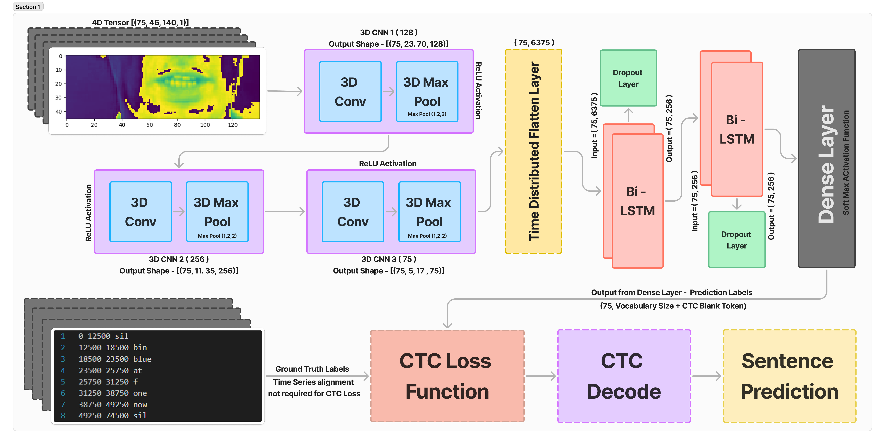

# **SpeakSee: Silent Speech Recognition with Bi-LSTM**

---

## **Overview**
SpeakSee is an advanced lip-reading system that leverages deep learning to interpret and transcribe silent speech from video sequences. By combining **3D Convolutional Neural Networks (3D CNNs)** with **Bidirectional Long Short-Term Memory Networks (Bi-LSTMs)** and utilizing the **Connectionist Temporal Classification (CTC)** loss function, this project provides a robust framework for automated lip reading.

This system is designed to enhance communication for the hearing-impaired, facilitate silent interactions, and improve speech recognition in noisy environments.

---

## **Key Features**
- **3D Convolutional Neural Networks (3D CNNs):** Extract spatiotemporal features from video frames to capture lip movements.
- **Bi-Directional LSTM Networks:** Model temporal dependencies in both forward and backward directions, ensuring contextual accuracy.
- **CTC Loss Function:** Efficiently aligns predicted sequences with ground truth text, eliminating the need for frame-level annotations.
- **End-to-End Training:** Simplifies the training pipeline for improved accuracy and scalability.

---

## **Applications**
- Assistive technology for individuals with hearing impairments.
- Speech recognition in noise-polluted environments.
- Silent communication interfaces.
- Enhanced human-computer interaction.

---

## **Project Workflow**
1. **Data Preprocessing:**
   - Extract video frames using OpenCV.
   - Normalize and resize frames to \(46 \times 140\) pixels.
   - Convert frames to grayscale to reduce complexity.

2. **Feature Extraction:**
   - Spatiotemporal features are extracted using 3D CNN layers with max-pooling for dimensionality reduction.

3. **Temporal Dependency Modeling:**
   - Bi-LSTM layers model the temporal relationships between consecutive frames.

4. **Prediction:**
   - A Dense layer with Softmax activation generates character probabilities for each frame.
   - The CTC Loss aligns these predictions with the ground truth text.

5. **Training and Optimization:**
   - Trained on the GRID Corpus dataset with Adam optimizer and a cosine annealing learning rate scheduler.

---

## **Model Architecture**
[](Images/ModelDiag.png)

---

## **Results**
- **Accuracy:** Achieved 94.0% accuracy on the test set.
- **Character Error Rate (CER):** 8.62%.
- **Word Error Rate (WER):** 12.45%.

The results demonstrate significant improvements over traditional methods, with enhanced generalization across diverse datasets.

---

## **Technologies Used**
- **Frameworks and Libraries:**
  - TensorFlow/Keras
  - OpenCV
  - NumPy, Matplotlib

- **Architecture:**
  - 3D CNN
  - Bi-LSTM
  - CTC Loss

---


## **Installation**
1. Clone the repository:
   ```bash
   git clone https://github.com/your_username/SpeakSee.git
   ```

3. Install dependencies:
   ```bash
   pip install -r requirements.txt
   ```

---

## **Contributors**
- **Preetam Teja**  
- **Sarvesh K**  
- **Durai Singh**
- **Samhitha S**

Supervised by **Dr. Mithun Kumar**

---

## **License**
This project is licensed under the [MIT License](LICENSE).

---

## **Acknowledgements**
- **Amrita School of Artificial Intelligence, Amrita Vishwa Vidyapeetham.**
- **GRID Corpus Dataset** for providing a robust and diverse dataset for training.
